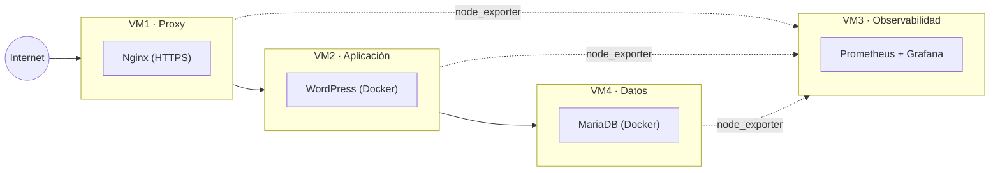
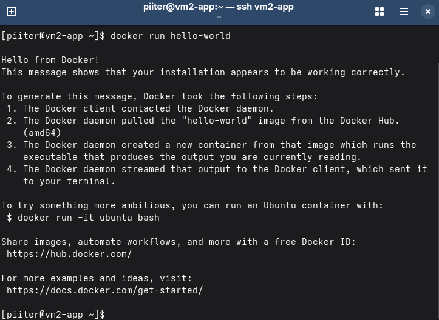
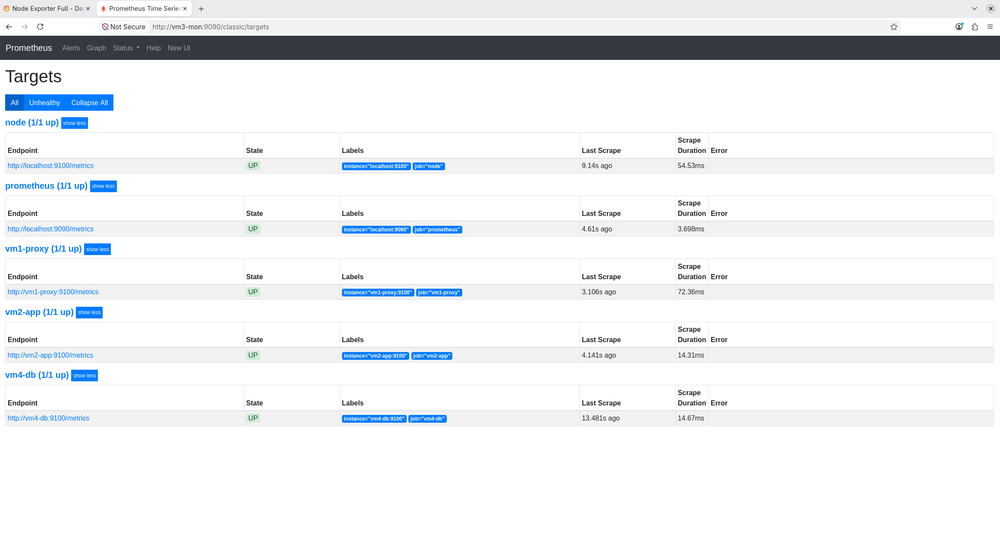
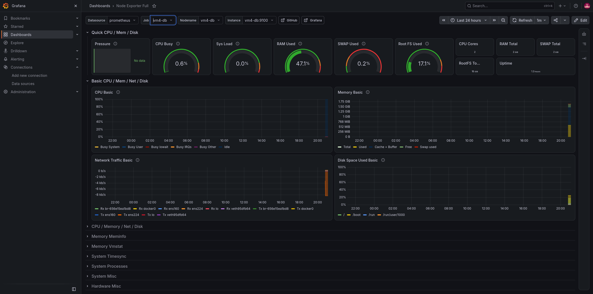

# Laboratorio de Infraestructura Web

Infraestructura web de 3 capas (presentación, aplicación, datos) más
observabilidad, montada como laboratorio de virtualización para practicar
administración de sistemas Linux y, más adelante, despliegue en la nube
con Infraestructura como Código.

## Objetivo del proyecto

Ganar experiencia práctica en sistemas y cloud replicando un entorno
similar al de una empresa: distintas distribuciones Linux, servicios
reales, seguridad básica, aislamiento real entre capas y monitorización,
con el objetivo final de automatizarlo con Ansible y desplegarlo en Azure
con Terraform.

## Arquitectura

**Las 3 capas reales:**
- **Presentación** → VM1 (Nginx, proxy inverso con HTTPS)
- **Aplicación / lógica de negocio** → VM2 (WordPress en Docker)
- **Datos** → VM4 (MariaDB en Docker, aislada en su propia máquina)

La observabilidad (VM3, Prometheus + Grafana) es infraestructura
transversal, no una capa de la arquitectura.

## Máquinas virtuales

| VM | Función | Distro | RAM | vCPU | Disco | IP (host-only) |
|---|---|---|---|---|---|---|
| Fedora | Puesto de trabajo | Fedora Workstation | 8 GB | 4 | 60 GB | 192.168.56.10 |
| VM1 | Proxy inverso (Nginx, HTTPS) | Ubuntu Server LTS | 2 GB | 1 | 20 GB | 192.168.56.11 |
| VM2 | Aplicación (WordPress) | Rocky Linux | 4 GB | 2 | 30 GB | 192.168.56.12 |
| VM3 | Monitorización (Prometheus + Grafana) | Debian | 4 GB | 2 | 40 GB | 192.168.56.13 |
| VM4 | Base de datos (MariaDB) | Rocky Linux | 4 GB | 2 | 30 GB | 192.168.56.14 |

Virtualizado con **VMware Workstation Pro** sobre Windows. Todas las VMs
tienen un adaptador NAT (internet) y un adaptador Host-only (VMnet1, red
interna del laboratorio).

## Stack utilizado

- **Proxy:** Nginx, HTTPS con certificado autofirmado
- **Aplicación:** WordPress en contenedor Docker
- **Base de datos:** MariaDB en contenedor Docker, en VM dedicada
- **Monitorización:** Prometheus, node_exporter, Grafana
- **Seguridad:** SELinux (Rocky), firewalld/ufw
- **Red:** red interna host-only con IPs fijas y resolución por `/etc/hosts`
- **Próximamente:** Ansible (automatización), Terraform (despliegue en Azure)

## Estado del proyecto

- [x] Instalación y configuración base de las 5 máquinas
- [x] Red interna host-only con IPs fijas entre todas las máquinas
- [x] Acceso SSH sin contraseña desde la Fedora a las 4 VMs de servidor
- [x] Firewall activo en las 4 VMs de servidor (ufw / firewalld)
- [x] WordPress desplegado en Docker en VM2
- [x] Base de datos separada en su propia VM (VM4), con aislamiento real
- [x] Proxy inverso en VM1 con HTTPS, funcionando de extremo a extremo
- [x] node_exporter en VM1, VM2 y VM4, monitorizadas desde VM3
- [x] Dashboard de Grafana con métricas de las 4 máquinas
- [ ] Automatización con Ansible
- [ ] Despliegue en Azure con Terraform

## Documentación por máquina

- [Fedora - Puesto de trabajo](docs/workstation-fedora.md)
- [VM1 - Proxy Nginx](docs/vm1-proxy.md)
- [VM2 - Aplicación (WordPress)](docs/vm2-app.md)
- [VM3 - Monitorización](docs/vm3-monitorizacion.md)
- [VM4 - Base de datos](docs/vm4-db.md)

## Lo que he aprendido

- Configuración de red host-only y NAT en VMware para simular un entorno de servidores, incluyendo varios fallos de adaptador mal asignado (IP fija en la interfaz equivocada, segundo adaptador faltante, o apuntando a una red host-only distinta de la compartida por el resto de VMs).
- Diferencias de administración entre familias de distros (`apt` en Debian/Ubuntu vs `dnf`/SELinux/firewalld en Rocky).
- Diagnóstico de fallos de resolución y conectividad usando `ip a`, `ip route`, `nmcli` y `ping`, capa por capa (red → firewall → servicio).
- Despliegue de aplicaciones en contenedores Docker, incluyendo que **los contenedores no heredan el `/etc/hosts` del sistema anfitrión** (hace falta `extra_hosts` para resolver nombres de la red del laboratorio).
- Corrección de un diseño de arquitectura de 3 capas mal aislado (base de datos en la misma VM que la aplicación) tras recibir una observación técnica válida, separando la base de datos en una VM dedicada (VM4) con su propio aislamiento de red y firewall.
- Configuración de Nginx como proxy inverso con HTTPS, reenviando peticiones a un servicio en otra máquina.
- Gestión de zonas y `sources` en firewalld (un mismo origen no puede pertenecer a dos zonas a la vez).
- Despliegue de Prometheus y Grafana para monitorización multi-máquina, incluyendo la instalación manual de `node_exporter` por binario en distros que no lo traen en sus repositorios, y la depuración de un `prometheus.yml` inválido (un `scrape_config` sin `job_name` tras una edición mal hecha) usando `journalctl` para localizar el error.

## Capturas

**Docker funcionando en VM2:**

**WordPress accesible a través del proxy de VM1:**

**Monitorización con Prometheus y Grafana:**

## Autor

[Pedro Morales] — Sistemas y Cloud
