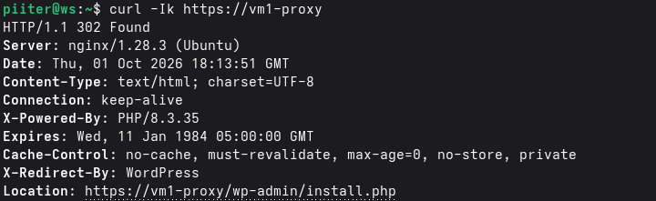

# VM1 - Proxy inverso (Nginx)

## Función

Punto de entrada de la infraestructura (capa de presentación). Recibe las
peticiones HTTP/HTTPS y las redirige hacia VM2 (aplicación). Sirve el
certificado HTTPS de cara al usuario.

## Especificaciones

| | |
|---|---|
| Distro | Ubuntu Server LTS |
| vCPU | 1 (1 procesador × 1 núcleo) |
| RAM | 2 GB |
| Disco | 20 GB |
| Hostname | vm1-proxy |

## Red

| Adaptador | Tipo | IP |
|---|---|---|
| 1 | NAT | asignada por DHCP (salida a internet) |
| 2 | Host-only (VMnet1) | 192.168.56.11/24 |

Configurada con netplan (`/etc/netplan/50-cloud-init.yaml`):
```yaml
network:
  version: 2
  ethernets:
    ens33:
      dhcp4: true
    ens37:
      dhcp4: false
      addresses: [192.168.56.11/24]
```
```bash
sudo netplan apply
```

Resolución de nombres de las demás máquinas añadida en `/etc/hosts`.
Acceso por SSH sin contraseña desde la Fedora (clave pública copiada con
`ssh-copy-id`).

## Software instalado

- `nginx`
- `openssl`
- `ufw`
- `prometheus-node-exporter`
- `open-vm-tools`

## Firewall

`ufw` activo, con estas reglas:
```bash
sudo ufw allow OpenSSH
sudo ufw allow 'Nginx Full'
sudo ufw allow from 192.168.56.0/24
sudo ufw allow from 192.168.56.0/24 to any port 9100
sudo ufw enable
```

## Configuración del proxy inverso

Archivo `/etc/nginx/sites-available/proxy` (enlazado en `sites-enabled`,
con el sitio por defecto desactivado):

```nginx
server {
    listen 80;
    server_name vm1-proxy;
    return 301 https://$host$request_uri;
}

server {
    listen 443 ssl;
    server_name vm1-proxy;

    ssl_certificate     /etc/nginx/ssl/vm1.crt;
    ssl_certificate_key /etc/nginx/ssl/vm1.key;

    location / {
        proxy_pass http://vm2-app:8080;
        proxy_set_header Host $host;
        proxy_set_header X-Real-IP $remote_addr;
        proxy_set_header X-Forwarded-For $proxy_add_x_forwarded_for;
        proxy_set_header X-Forwarded-Proto $scheme;
    }
}
```

El proxy redirige todo el tráfico HTTP (puerto 80) a HTTPS (puerto 443), y
reenvía las peticiones a WordPress, que corre en Docker en VM2
(`vm2-app:8080`).

## Monitorización

`prometheus-node-exporter` instalado y expuesto en el puerto 9100, vigilado
por Prometheus desde VM3 (job `vm1-proxy`):
```bash
sudo apt install -y prometheus-node-exporter
sudo systemctl enable --now prometheus-node-exporter
curl -s localhost:9100/metrics | head
```

## Pasos realizados

1. Instalación de Ubuntu Server LTS (instalación mínima, con OpenSSH server
   activado desde el instalador).
2. Actualización del sistema e instalación de Nginx:
   ```bash
   sudo apt update && sudo apt upgrade -y
   sudo apt install -y nginx openssl ufw
   sudo systemctl enable --now nginx
   ```
3. Generación de un certificado autofirmado para HTTPS:
   ```bash
   sudo mkdir -p /etc/nginx/ssl
   sudo openssl req -x509 -nodes -days 365 -newkey rsa:2048 \
     -keyout /etc/nginx/ssl/vm1.key -out /etc/nginx/ssl/vm1.crt \
     -subj "/CN=vm1-proxy"
   ```
4. Añadido el segundo adaptador de red (Host-only) y configurada su IP fija
   con netplan.
5. Activación del firewall (`ufw`) con las reglas de la sección **Firewall**.
6. Creación del bloque de configuración de Nginx como proxy inverso hacia
   VM2 (ver sección **Configuración del proxy inverso**) y recarga del
   servicio:
   ```bash
   sudo ln -s /etc/nginx/sites-available/proxy /etc/nginx/sites-enabled/proxy
   sudo rm -f /etc/nginx/sites-enabled/default
   sudo nginx -t
   sudo systemctl reload nginx
   ```
7. Verificación del flujo completo desde la Fedora:
   ```bash
   curl -Ik https://vm1-proxy
   ```
   Respuesta recibida: `HTTP/1.1 302 Found`, con cabecera `X-Redirect-By:
   WordPress` y `Location: https://vm1-proxy/wp-admin/install.php`,
   confirmando que la petición llega a VM1, se reenvía a VM2 y vuelve la
   respuesta de WordPress.
8. Instalación de `prometheus-node-exporter` y apertura del puerto 9100 en
   `ufw` para que Prometheus (VM3) pueda monitorizarla.

## Pendiente

- [ ] Sustituir el certificado autofirmado por uno de Let's Encrypt.

## Problemas encontrados

- Al añadir el segundo adaptador de red (host-only) en VMware, la IP fija
  se asignó por error a la interfaz que en realidad era el adaptador NAT,
  dejando la máquina sin salida a internet. Se solucionó revisando con
  `ip a` / `ip route` cuál era cada interfaz y corrigiendo la asignación en
  netplan.

## Capturas


