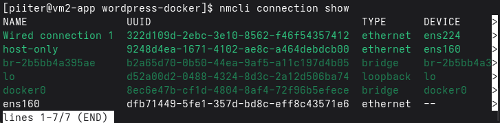
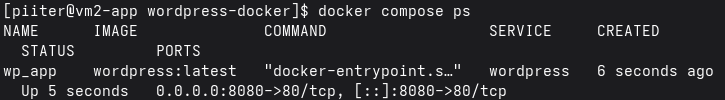
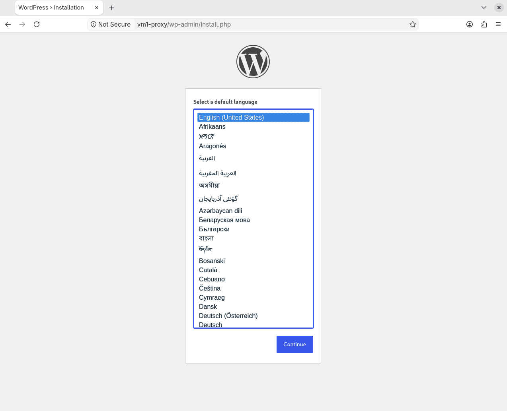

# VM2 - Aplicación (capa de lógica de negocio)

## Función

Aloja la aplicación web (WordPress) en un contenedor Docker. Recibe el
tráfico reenviado por VM1 (proxy) y se conecta a la base de datos alojada
en VM4. No contiene base de datos propia: está completamente separada de
la capa de datos, en su propia máquina.

## Especificaciones

| | |
|---|---|
| Distro | Rocky Linux |
| vCPU | 2 (1 procesador × 2 núcleos) |
| RAM | 4 GB |
| Disco | 30 GB |
| Hostname | vm2-app |

## Red

| Adaptador | Tipo | IP |
|---|---|---|
| 1 | NAT | asignada por DHCP (salida a internet) |
| 2 | Host-only (VMnet1) | 192.168.56.12/24 |

Configurada con NetworkManager:
```bash
sudo nmcli connection add type ethernet ifname <interfaz-host-only> con-name host-only \
  ipv4.method manual ipv4.addresses 192.168.56.12/24
sudo nmcli connection up host-only
```

Resolución de nombres de las demás máquinas (incluida VM4) añadida en
`/etc/hosts`. Acceso por SSH sin contraseña desde la Fedora.

## Software instalado

- `docker-ce`, `docker-ce-cli`, `containerd.io`, `docker-compose-plugin`
- `node_exporter` (binario oficial, con servicio systemd propio)
- `epel-release`
- `open-vm-tools`
- Herramientas base: `vim`, `curl`, `wget`, `htop`, `tmux`, `bash-completion`

> Nota: `mariadb-server` se instaló inicialmente en esta VM, pero se
> eliminó el uso de la base de datos local al separar la capa de datos en
> VM4 (ver sección **Problemas encontrados**).

## Seguridad

- **SELinux:** activo en modo `Enforcing` (sin modificar).
- **firewalld:** activo, con estas reglas:
  ```bash
  sudo firewall-cmd --permanent --add-service=ssh
  sudo firewall-cmd --permanent --add-source=192.168.56.0/24
  sudo firewall-cmd --permanent --add-port=8080/tcp
  sudo firewall-cmd --permanent --add-port=9100/tcp
  sudo firewall-cmd --reload
  ```

## Aplicación: WordPress en Docker (conectado a VM4)

`~/wordpress-docker/docker-compose.yml`:

```yaml
services:
  wordpress:
    image: wordpress:latest
    container_name: wp_app
    restart: unless-stopped
    environment:
      WORDPRESS_DB_HOST: vm4-db:3306
      WORDPRESS_DB_NAME: ${MYSQL_DATABASE}
      WORDPRESS_DB_USER: ${MYSQL_USER}
      WORDPRESS_DB_PASSWORD: ${MYSQL_PASSWORD}
    extra_hosts:
      - "vm4-db:192.168.56.14"
    ports:
      - "8080:80"
    volumes:
      - wp_data:/var/www/html

volumes:
  wp_data:
```

Las credenciales en `.env` deben coincidir exactamente con las usadas en
`~/mariadb-docker/.env` en VM4.

## Monitorización

`node_exporter` instalado desde el binario oficial (Rocky no lo trae en
sus repositorios estándar), como servicio systemd, en el puerto 9100,
vigilado por Prometheus desde VM3 (job `vm2-app`).

## Pasos realizados

1. Instalación de Rocky Linux (Minimal Install) y de Docker desde el
   repositorio oficial.
2. Activación del firewall (`firewalld`) con las reglas de la sección
   **Seguridad**.
3. Despliegue inicial de WordPress + MariaDB en el mismo `docker-compose.yml`
   (ambos servicios en VM2).
4. **Separación de la base de datos en VM4** (ver sección siguiente):
   - Parada de los contenedores: `docker compose down`.
   - Eliminado el servicio `db` del `docker-compose.yml`, dejando solo
     `wordpress`.
   - Cambiado `WORDPRESS_DB_HOST` a `vm4-db:3306`.
   - Añadido `extra_hosts` para que el contenedor resuelva `vm4-db`
     (ver **Problemas encontrados**).
   - Verificada la conexión y completada de nuevo la instalación de
     WordPress contra la base de datos ya alojada en VM4.
5. Instalación de `node_exporter` y apertura del puerto 9100.

## Pendiente

- Ninguno relevante por el momento (próximo bloque: Ansible/Terraform).

## Problemas encontrados

- **Arquitectura de 3 capas mal aislada inicialmente**: WordPress y
  MariaDB corrían en la misma VM (aunque en contenedores separados), lo
  que no respeta el aislamiento real que exige una arquitectura de 3
  capas (presentación / lógica / datos, cada una en su propio servidor).
  Se corrigió creando **VM4**, dedicada exclusivamente a la base de datos,
  y reconfigurando WordPress para conectarse a ella por red.
- Al revisar la red, se detectó que la VM solo tenía una interfaz de red
  física configurada como host-only, sin segundo adaptador NAT, dejando la
  máquina sin salida a internet. Se solucionó añadiendo un segundo
  adaptador de red en VMware y configurando cada interfaz por separado.

  

- Al intentar abrir el puerto 8080 en una zona `trusted` de firewalld, el
  comando falló porque la red `192.168.56.0/24` ya estaba asociada como
  `source` a la zona `public`. Se resolvió añadiendo el puerto a la zona
  `public` en lugar de crear una zona nueva.
- **Tras mover la base de datos a VM4**, WordPress devolvía un error
  `500 Internal Server Error`. La causa: los contenedores Docker no
  heredan el `/etc/hosts` del sistema anfitrión, por lo que el contenedor
  de WordPress no podía resolver el nombre `vm4-db`, aunque sí resolvía
  correctamente desde fuera del contenedor (`curl` en la propia VM2 sí
  funcionaba). Se solucionó añadiendo `extra_hosts: ["vm4-db:192.168.56.14"]`
  en el `docker-compose.yml`, que inyecta la resolución de ese nombre
  directamente dentro del contenedor.

## Capturas



