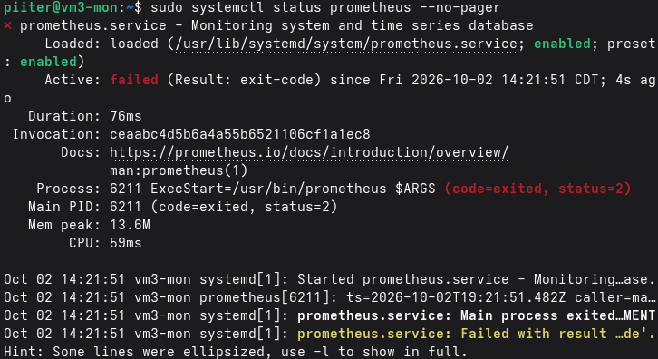

# VM3 - Monitorización (Prometheus + Grafana)

## Función

Recoge métricas de todas las máquinas del laboratorio (VM1, VM2, VM4 y
ella misma) y las muestra en dashboards. Prometheus almacena las métricas
y Grafana las visualiza. No es una "capa" de la arquitectura de 3 capas:
es infraestructura de observabilidad, transversal a las demás.

## Especificaciones

| | |
|---|---|
| Distro | Debian (estable) |
| vCPU | 2 (1 procesador × 2 núcleos) |
| RAM | 4 GB |
| Disco | 40 GB |
| Hostname | vm3-mon |

## Red

| Adaptador | Tipo | IP |
|---|---|---|
| 1 | NAT | asignada por DHCP (salida a internet) |
| 2 | Host-only (VMnet1) | 192.168.56.13/24 |

Resolución de nombres de las demás máquinas (VM1, VM2, VM4) añadida en
`/etc/hosts`. Acceso por SSH sin contraseña desde la Fedora.

## Software instalado

- `prometheus`
- `prometheus-node-exporter`
- `grafana`
- `open-vm-tools`
- Herramientas base: `vim`, `curl`, `wget`, `htop`, `tmux`, `gpg`

## Puertos de los servicios

| Servicio | Puerto |
|---|---|
| Prometheus | 9090 |
| node_exporter | 9100 |
| Grafana | 3000 |

## Firewall

`ufw` activo:
```bash
sudo ufw allow OpenSSH
sudo ufw allow from 192.168.56.0/24
sudo ufw allow from 192.168.56.0/24 to any port 9090
sudo ufw allow from 192.168.56.0/24 to any port 3000
```

## Configuración de Prometheus

`/etc/prometheus/prometheus.yml`, con un job por máquina monitorizada:

```yaml
scrape_configs:
  - job_name: 'prometheus'
    scrape_interval: 5s
    scrape_timeout: 5s
    static_configs:
      - targets: ['localhost:9090']

  - job_name: 'node'
    static_configs:
      - targets: ['localhost:9100']

  - job_name: 'vm1-proxy'
    static_configs:
      - targets: ['vm1-proxy:9100']

  - job_name: 'vm2-app'
    static_configs:
      - targets: ['vm2-app:9100']

  - job_name: 'vm4-db'
    static_configs:
      - targets: ['vm4-db:9100']
```

Estado de los targets verificado en `http://vm3-mon:9090/classic/targets`:
los 5 jobs (`prometheus`, `node`, `vm1-proxy`, `vm2-app`, `vm4-db`) en
estado **UP**.

## Grafana

- Fuente de datos: Prometheus, URL `http://localhost:9090`.
- Dashboard importado: **Node Exporter Full** (ID 1860 en grafana.com),
  con selector de instancia para ver las métricas de cada máquina por
  separado.

## Pasos realizados

1. Instalación de Debian (instalación mínima, solo con servidor SSH y
   utilidades estándar del sistema).
2. Instalación de Prometheus, node_exporter y Grafana (ver instalación
   base del laboratorio).
3. Activación del firewall (`ufw`).
4. Configuración de `prometheus.yml` con los jobs de VM1, VM2 y VM4.
5. Verificación de los targets en la interfaz de Prometheus.
6. Configuración de Grafana: fuente de datos Prometheus e importación del
   dashboard de node_exporter.

## Problemas encontrados

- Al añadir el repositorio de Grafana con `echo`, la URL se partió en dos
  líneas al pegar el comando en la terminal, dejando el archivo
  `/etc/apt/sources.list.d/grafana.list` corrupto (error `Could not
  resolve 'apt'` al ejecutar `apt update`). Se solucionó reescribiendo el
  archivo con un heredoc (`<<'EOF' ... EOF`), que no se ve afectado por el
  ajuste de línea del terminal.
- Al añadir los nuevos jobs de VM1, VM2 y VM4 en `prometheus.yml`, se
  insertaron en medio del archivo y partieron el bloque original del job
  `prometheus`, dejando un `static_configs` sin `job_name` asociado (YAML
  inválido). Esto hacía que el servicio fallara al arrancar
  (`systemctl status` mostraba `failed`, código de salida 2). Se
  diagnosticó con `journalctl -u prometheus` y se solucionó reescribiendo
  el archivo completo con un job por máquina, bien delimitado.
- Olvidada la contraseña de administrador de Grafana tras el primer
  cambio. Se reseteó desde la línea de comandos:
  ```bash
  sudo systemctl stop grafana-server
  sudo grafana-cli --homepath "/usr/share/grafana" --config "/etc/grafana/grafana.ini" admin reset-admin-password <nueva_contraseña>
  sudo systemctl start grafana-server
  ```
  - Al añadir los nuevos jobs de VM1, VM2 y VM4 en `prometheus.yml`, se
  insertaron en medio del archivo y partieron el bloque original del job
  `prometheus`, dejando un `static_configs` sin `job_name` asociado (YAML
  inválido). Esto hacía que el servicio fallara al arrancar
  (`systemctl status` mostraba `failed`, código de salida 2). Se
  diagnosticó con `journalctl -u prometheus` y se solucionó reescribiendo
  el archivo completo con un job por máquina, bien delimitado.

  

## Capturas


